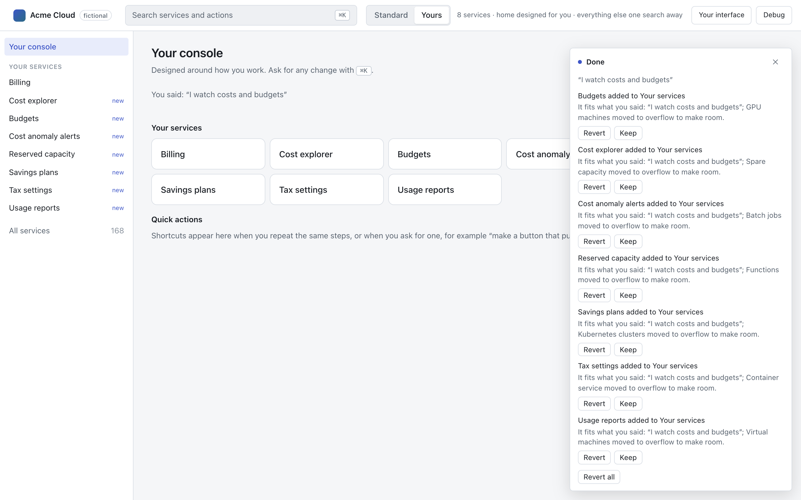
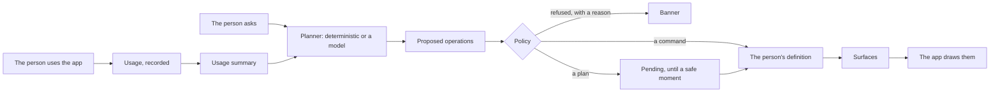

<p align="center">
  
</p>

<h1 align="center">Uitive</h1>

<p align="center">
  Adapt the User Interface through Learning from Usage.
</p>

<p align="center">
  <a href="LICENSE"></a>
</p>

<p align="center">
  <a href="docs/getting-started.md"><b>Getting started</b></a> ·
  <a href="#documentation">Documentation</a> ·
  <a href="#demos">Demos</a> ·
  <a href="docs/findings.md">Findings</a>
</p>

<br />



## The idea

Large applications show everything to everyone; each person uses a small, personal part of it. Uitive lets an interface converge on that part, learned from usage and redesigned by asking in plain language, within the boundaries the application declares.

- **The application declares a contract** of what may adapt: toolbars and menus, settings, whole pages built from its own components and its data, and the actions people can run.
- **Planners propose, within it.** A deterministic planner learns from use and answers plain commands, offline and without a key. A language model on the application's server, from any provider (Claude, GPT, Gemini or a local model), answers requests in plain words and redesigns pages; structured outputs make anything outside the contract unrepresentable.
- **Policy decides what applies, and when**: required items stay, every action stays reachable, nothing moves while someone works, and nothing changes data without the person's yes.
- **The person owns the result**: every change is listed with its reason, and can be kept, reverted, exported or reset.

## Quick start

```sh
pnpm add @plurid/uitive-core @plurid/uitive-react zod
```

Declare what may adapt, such as a notes editor's toolbar:

<!-- example: docs/examples/quick-start/contract.ts -->

```ts
import { action, defineApp, list } from '@plurid/uitive-core';

export const contract = defineApp({
  id: 'notes',
  description: 'A notes editor',
  actions: {
    bold: action({ label: 'Bold', description: 'Make the selection bold' }),
    italic: action({ label: 'Italic', description: 'Make the selection italic' }),
    link: action({ label: 'Link', description: 'Link the selection' }),
    heading: action({ label: 'Heading', description: 'Turn the line into a heading' }),
    share: action({ label: 'Share', description: 'Share the note' }),
    quote: action({ label: 'Quote', description: 'Turn the paragraph into a quote' }),
    code: action({ label: 'Code', description: 'Format the selection as code' }),
    table: action({ label: 'Table', description: 'Insert a table' }),
  },
  surfaces: {
    toolbar: list({
      label: 'Toolbar',
      description: 'Formatting and insertion, above the note',
      items: ['bold', 'italic', 'link', 'heading', 'share', 'quote', 'code', 'table'],
      capacity: 5,
      required: ['share'],
      reorderable: true,
    }),
  },
});
```

Create a client. It learns from use, answers commands, and keeps each person's interface in their browser:

<!-- example: docs/examples/quick-start/client.ts -->

```ts
import { createUitive, localStore } from '@plurid/uitive-core';
import { contract } from './contract.js';

// Learns from use and changes when asked; the person's interface is kept in this browser.
export const uitive = createUitive({
  contract,
  store: localStore('notes'),
});
```

Draw the toolbar from the person's interface with your own components, and record each use:

<!-- example: docs/examples/quick-start/toolbar.tsx -->

```tsx
import { useState } from 'react';
import { useSurface } from '@plurid/uitive-react';
import { uitive } from './client.js';

/** The toolbar each person shaped: what fits, then the rest under More. */
export function Toolbar({ run }: { run(action: string): void }) {
  const toolbar = useSurface(uitive, 'toolbar');
  const [more, setMore] = useState(false);
  return (
    <div role="toolbar" aria-label="Formatting">
      {toolbar.visible.map((item) => (
        <button
          key={item.id}
          type="button"
          onClick={() => {
            uitive.record(item.id, { via: 'region', surface: 'toolbar' });
            run(item.id);
          }}
        >
          {item.label}
        </button>
      ))}
      {toolbar.overflow.length > 0 && (
        <button type="button" aria-expanded={more} onClick={() => setMore(!more)}>
          More
        </button>
      )}
      {more && (
        <div role="menu">
          {toolbar.overflow.map((item) => (
            <button
              key={item.id}
              type="button"
              role="menuitem"
              onClick={() => {
                setMore(false);
                uitive.record(item.id, { via: 'overflow', surface: 'toolbar' });
                run(item.id);
              }}
            >
              {item.label}
            </button>
          ))}
        </div>
      )}
    </div>
  );
}
```

Wrap the editor in `UitiveProvider`, and add `<UitiveBanner>` and an ask box built on `useCommand`. Now "hide Bold" or "move Table to the top" changes the toolbar for that person alone. Someone who keeps opening Table from More finds it on the toolbar at the start of a later session, with the banner saying why and Revert one click away. [Getting started](docs/getting-started.md) walks through every step.

### With a coding agent

```sh
npx @plurid/uitive-cli init
```

`init` installs the packages, writes a Uitive folder with every page as the page it already is, and configures your coding agents with a playbook they follow step by step; `uitive check` is the gate. Then ask the agent to integrate Uitive. In Claude Code, the plugin brings the same to every project: `/plugin marketplace add plurid/uitive`, then `/plugin install uitive@plurid-uitive`. See [Coding agents](docs/coding-agents.md).

## What people can ask for

| They say or do                                                    | What happens                                                        | Planner                              |
| ----------------------------------------------------------------- | ------------------------------------------------------------------- | ------------------------------------ |
| "hide Bold", "move Table to the top", "compact"                   | The toolbar or setting changes at once                              | Deterministic                        |
| Open Table from More, session after session                       | Table joins the toolbar at the start of a later session             | Deterministic                        |
| "I watch costs and budgets"                                       | What serves that goal comes forward, as in the picture above        | A model, or shared words without one |
| "make my home a morning check of what needs attention"            | A redesigned page, from the application's own blocks and data       | A model                              |
| "put each customer's lifetime value beside their failed payments" | A table joining two sources, read with the person's own permissions | A model                              |

## How it works



Use is recorded as numbers, never as content. A planner proposes operations over the contract's IDs, and policy checks each one against the contract, the person's own changes and the application's rules. Commands apply at once; planned changes wait for a safe moment, when a session starts. The person's definition records every change with its reason, and the application draws its surfaces as it always has. [How it works](docs/how-it-works.md) tells the whole story.

The same engine also runs in a private browser extension prototype, which applies it to sites it doesn't own through adapters, with the person's own key: see [apps/extension](apps/extension/README.md) and [ADR 0006](docs/adr/0006-two-front-doors.md).

## Demos

**Acme Cloud**, the picture above: a fictional cloud console of 168 services and their actions, where each person's console converges on what they use.

```sh
pnpm install
pnpm --filter @uitive/cloud-console-react dev   # at localhost:5171
```

Say what you use the cloud for on the home page, ask for changes with ⌘K, compare Standard and Yours, and open Debug to simulate a week of use as a persona. With a key in `apps/cloud-console-react/.env.local` (`ANTHROPIC_API_KEY`, `OPENAI_API_KEY` or `GEMINI_API_KEY`), requests in plain words are planned by that provider's model on the dev server; without one, the deterministic planner answers.

**The extension** reshapes a fictional payments dashboard: build it and load it unpacked, as [its README](apps/extension/README.md#try-it-on-the-fictional-dashboard) shows.

**The proof**: three coding agents, each with only the agent kit, integrated Excalidraw in 40 minutes, Medusa Admin in 37 and Grist in 54, meeting every point of their definitions of done. [Findings](docs/findings.md) has each run, and every gap found with what changed since.

## Packages

| Package                                                | What it holds                                                                                                                 |
| ------------------------------------------------------ | ----------------------------------------------------------------------------------------------------------------------------- |
| [`@plurid/uitive-core`](packages/core/README.md)       | Contracts, sources and queries, usage learning, policy and the deterministic planner; runs anywhere                           |
| [`@plurid/uitive-react`](packages/react/README.md)     | The provider, hooks, the page renderer, generic blocks and the kit                                                            |
| [`@plurid/uitive-dom`](packages/dom/README.md)         | Adapting existing markup without React, and the meta-interface as custom elements                                             |
| [`@plurid/uitive-planner`](packages/planner/README.md) | The model planner, for any provider: schemas, prompt, repair, and models from Anthropic, OpenAI-compatible servers and Gemini |
| [`@plurid/uitive-server`](packages/server/README.md)   | The planner's handler, for any Fetch runtime, Express and Node                                                                |
| [`@plurid/uitive-adapter`](packages/adapter/README.md) | Accessibility trees and discovery, for pages Uitive doesn't own                                                               |
| [`@plurid/uitive-cli`](packages/cli/README.md)         | The agent kit: detect, init, survey, generate, discover and check                                                             |
| [`@plurid/uitive-mcp`](packages/mcp/README.md)         | The agent kit as Model Context Protocol tools                                                                                 |

They are ES modules with TypeScript declarations, which CommonJS can `require` on Node 22.12 or later. They need Node 22 or later for the tools, React 18.3 or 19 for the React bindings, and zod 4.2 or later, shared with the application. It is a rewrite of the 2019 library, archived in [legacy](legacy/README.md).

## Documentation

- [Getting started](docs/getting-started.md): a first integration, a toolbar that learns from use and changes when asked
- [How it works](docs/how-it-works.md): the loop, commands and plans, safe moments, and why the person owns the result
- [Contracts](docs/contracts.md): actions, lists, choices, collections, contexts, routes and regions, and changing a contract
- [Data and actions](docs/data-and-actions.md): sources, bindings, queries, and actions that run with the person's yes
- [Pages](docs/pages.md): whole pages people redesign, from regions, generic blocks and your own components
- [React](docs/react.md): the provider, every hook, the page renderer and the kit
- [Without React](docs/without-react.md): adapting existing markup, and the custom elements
- [Planning](docs/planning.md): the deterministic planner, learning from use, and any model on your server
- [Testing](docs/testing.md): deterministic clients, sessions on demand and simulated personas
- [Coding agents](docs/coding-agents.md): the CLI, curation, discovery, MCP and the Claude Code plugin
- [Privacy and security](docs/privacy-and-security.md): what leaves the device, who holds keys, and what policy guarantees
- [Troubleshooting](docs/troubleshooting.md): messages and symptoms, with their fixes
- [Findings](docs/findings.md): three timed integrations by coding agents, and what they changed
- [API reference](docs/api/README.md): every export, generated from the source
- [Examples](docs/examples/README.md): the code in these pages, typechecked and tested
- [CONTEXT.md](CONTEXT.md) and [decisions](docs/adr/README.md): the vocabulary, invariants and architectural decisions

## Develop

```sh
pnpm install
pnpm check   # lint, format, typecheck (which builds the packages) and every test
pnpm docs    # refreshes the examples in the docs and the generated API reference
```

Development needs Node 24 or later and pnpm 11.

| Directory  | What lives there                                                         |
| ---------- | ------------------------------------------------------------------------ |
| `packages` | The eight packages                                                       |
| `apps`     | The Acme Cloud demo and the browser extension prototype                  |
| `docs`     | Guides, examples, the API reference, decisions and findings              |
| `plugins`  | The Claude Code plugin                                                   |
| `tools`    | Build scripts, shared configuration, fixtures and the repository's tests |
| `about`    | The identity                                                             |
| `legacy`   | The 2019 implementation, archived                                        |

## Licence

[MIT](LICENSE) © 2019 Plurid, Inc.
