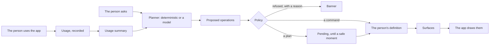

# How it works

Uitive has one rule: the model proposes, the contract constrains, policy disposes, and the person owns the result. Everything below follows from it. [CONTEXT.md](../CONTEXT.md) holds the exact vocabulary and invariants; this page tells the story.

## The loop

1. **The application declares a contract**: its actions, the surfaces that may adapt (lists, choices, collections and pages), and the data pages may show. It is the only vocabulary a planner may use.
2. **Use is recorded**: which action, how it was reached (directly, from overflow, the palette, a suggestion, a shortcut or a command) and in which session. Never params, never text typed into the application.
3. **A planner proposes operations**: promote this, hide that, set this choice, redesign that page. The deterministic planner answers plain commands and learns from use; a language model on your server, from any provider, answers requests in plain words and redesigns pages.
4. **Policy checks every operation**: against the contract's IDs, required items, capacities, the person's own changes, cooldowns, validators and the evidence it claims. What fails is refused with a reason the person reads.
5. **The stabilizer decides when**: commands apply at once; planned changes wait for a safe moment.
6. **The definition records what applied**, with who proposed it and why, and every surface is computed from it. The application draws surfaces as it always has, with its own components.

## Commands and plans

A **command** is the person asking: "hide Bold", "move Table to the top", "make my home a morning check". It is planned at once and applies at once, and the banner says what happened. What the person named outright joins their own layer; what a model adds for a goal they state joins the model's. A model's answer never deletes one of the person's own pages: they delete it themselves, from "Your interface".

A **plan** comes from use: the provider, or `startUitive` without React, asks the planner once a session, as it starts. What policy accepts becomes pending, and applies only at a **safe moment**: the start of a later session, when the person comes back after a while. At most two structural changes apply at a time, and at most one item leaves each list; an item that moved keeps its place for three sessions, whichever change would move it; and a model's change applies only once a plan in a later session agrees, unless the evidence is strong. Nothing moves while someone works, not even when they open a second tab.

A planned **redesign** of a page, or a suggested item for a collection, is only ever a suggestion: the person previews it, accepts it or dismisses it.

## Layers

Precedence runs from the application's policy, through the person's own changes, to the model's. A planner can't hide something the person pinned, or undo what they did; the person's word always wins, and the application's rules hold for both.

## Owned by the person

Every applied change is listed with what it did and why, in true numbers: "Table added to Toolbar", because "you opened Table from overflow 6 times".

- **Revert** undoes a change. A planned change that is reverted waits five sessions before it may return, and a second revert blocks it for good.
- **Keep** confirms a change: it moves to the person's own layer.
- **Freeze** stops planned changes; the person's own still apply.
- **Standard view** shows the application as shipped, with nothing changed, and back.
- **Export and import** carry the definition to another device, checked like any change; **reset** puts the layout back to standard, keeping usage, freeze, blocked changes and the stated goal.

## Data and actions

Planners see sources' schemas, never their rows. A page's queries are data: policy checks each field, filter and limit, and the application's bindings run them with the person's own permissions. Actions run through the application's `perform`, and nothing changes data without the person's yes: one step for a write, a typed phrase for a destructive run. A planner may never run anything by itself. [Data and actions](data-and-actions.md) has the details, and [Privacy and security](privacy-and-security.md) the guarantees.

## Two front doors

The same engine runs in two places. An application integrates it, with a contract it declares and bindings to its own code: the subject of these guides. A private browser extension prototype applies it to sites it doesn't own, through adapters: anchors into the page and official APIs read with the person's own key. Its README is [apps/extension/README.md](../apps/extension/README.md).

## Decisions

- [ADR 0001](adr/0001-model-proposes-contract-constrains-policy-disposes.md): the model proposes, the contract constrains, policy disposes.
- [ADR 0002](adr/0002-sources-and-queries-as-data.md): sources and queries as data, never code or SQL.
- [ADR 0003](adr/0003-actions-that-run.md): actions that run, with the person's yes.
- [ADR 0004](adr/0004-flat-pages-and-regions.md): pages as flat elements, with regions for what already exists.
- [ADR 0005](adr/0005-planning-at-scale.md): planning at scale: areas, repair and streaming.
- [ADR 0006](adr/0006-two-front-doors.md): one engine, two front doors.
- [ADR 0007](adr/0007-the-agent-kit.md): the agent kit: generated, curated, checked.
- [ADR 0008](adr/0008-any-model-plans.md): any model plans, from any provider, with the schema still the boundary.
- [ADR 0009](adr/0009-renamed-to-uitive.md): the product's name, Uitive, everywhere, before publishing.
